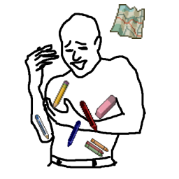

# PZ_MapEditWithoutPens

Enable map editing without having pens, pencils, crayons or the eraser in your inventory. I find it a bit frustrating having to carry all these practically weightless items and have them clutter your inventory.

Compatible with Wipe's Extra Map Symbols.

Workshop ID: 2729545876
Mod ID: Kaldo_MapEditWithoutPens
